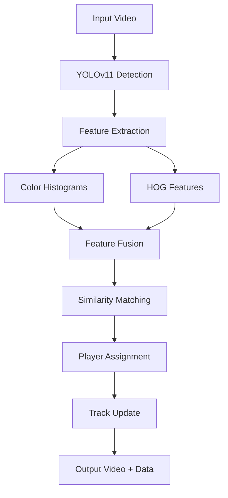

# player-re-identification-project
 
# Player Re-Identification System 🏃‍♂️⚽

[](https://www.python.org/downloads/)
[](https://pytorch.org/)
[](https://github.com/ultralytics/ultralytics)


A robust computer vision system for tracking and re-identifying players across video frames in sports scenarios. Combines YOLOv11 object detection with advanced feature extraction and temporal tracking algorithms.


## 🚀 Features

- **Multi-Modal Tracking**: Combines appearance features (color, texture) with spatial-temporal information
- **Robust Re-Identification**: Handles occlusions, similar appearances, and dynamic movements  
- **Real-time Processing**: Optimized for ~15-20 FPS on modern GPUs
- **Comprehensive Output**: Annotated videos, trajectory data, and detailed statistics
- **Flexible Configuration**: Adjustable parameters for different sports and scenarios

## 📋 Quick Start

### Prerequisites

- Python 3.8 or higher
- CUDA-capable GPU (recommended for real-time processing)
- 4GB+ RAM

### Installation

1. **Clone the repository**
   ```bash
   git clone https://github.com/yourusername/player-reid-system.git
   cd player-reid-system
   ```

2. **Create virtual environment**
   ```bash
   python -m venv venv
   source venv/bin/activate  # On Windows: venv\Scripts\activate
   ```

3. **Install dependencies**
   ```bash
   pip install -r requirements.txt
   ```

4. **Download the required model file**
   ```bash
   # Go to the Google Drive link and download best.pt
   # https://drive.google.com/file/d/1-5fOSHOSB9UXyP_enOoZNAMScrePVcMD/view
   
   # Or use gdown (install first: pip install gdown)
   gdown https://drive.google.com/uc?id=1-5fOSHOSB9UXyP_enOoZNAMScrePVcMD
   ```

### 📦 Dependencies

Create a `requirements.txt` file with:
```txt
torch>=2.0.0
torchvision>=0.15.0
ultralytics>=8.0.0
opencv-python>=4.8.0
scikit-learn>=1.3.0
numpy>=1.24.0
gdown>=4.6.0
```

## 🎯 Model Setup

### Download Required Model File

**Important**: You need to download the custom-trained model file for this system to work properly.

1. **Download the model file**:
   - Go to: https://drive.google.com/file/d/1-5fOSHOSB9UXyP_enOoZNAMScrePVcMD/view
   - Download the `best.pt` file
   - Place it in your project directory

2. **Alternative download methods**:
   ```bash
   # Using gdown (install with: pip install gdown)
   gdown https://drive.google.com/uc?id=1-5fOSHOSB9UXyP_enOoZNAMScrePVcMD
   
   # Or use wget if direct link is available
   # wget -O best.pt "https://drive.google.com/uc?export=download&id=1-5fOSHOSB9UXyP_enOoZNAMScrePVcMD"
   ```

3. **Verify the file**:
   ```bash
   # Check if the model file exists and has reasonable size
   ls -lh best.pt
   # Should show a file of several MB in size
   ```

### File Structure After Download
```
player-reid-system/
├── player_reid.py          # Main system code
├── best.pt                 # ← Downloaded model file (REQUIRED)
├── input_video.mp4         # Your input video
├── requirements.txt        # Dependencies
└── README.md              # This file
```

## 🏃‍♂️ Usage

### Basic Usage

1. **Prepare your video file**
   ```bash
   # Place your input video in the project directory
   cp /path/to/your/video.mp4 input_video.mp4
   ```

2. **Update file paths in the code**
   ```python
   # Edit main() function in player_reid.py
   model_path = "best.pt"
   video_path = "input_video.mp4"
   output_video_path = "output_with_tracking.mp4"
   ```

3. **Run the system**
   ```bash
   python player_reid.py
   ```

### Advanced Configuration

```python
# Create custom configuration
reid_system = PlayerReIdentificationSystem(
    model_path="best.pt",
    confidence_threshold=0.6  # Adjust detection sensitivity
)

# Fine-tune tracking parameters
reid_system.max_distance_threshold = 120      # Max pixel movement between frames
reid_system.feature_similarity_threshold = 0.65  # Appearance matching strictness
reid_system.max_frames_missing = 40           # Occlusion tolerance (frames)
reid_system.feature_history_size = 15         # Memory window size
```

## 📊 Expected Output

```
Initializing Player Re-Identification System...
Processing video...
Processed 30 frames...
Processed 60 frames...
Video processing complete. Total frames: 450
Total unique players detected: 12

=== TRACKING SUMMARY ===
Total frames processed: 450
Total unique players: 12
Average detections per frame: 8.73
Max detections in a frame: 14
Min detections in a frame: 4

=== PLAYER STATISTICS ===
Player 1: 89 appearances, last seen frame 448
Player 2: 156 appearances, last seen frame 449
```

### Generated Files

- `output_with_tracking.mp4` - Annotated video with player IDs and bounding boxes
- `tracking_data.pkl` - Serialized tracking data for further analysis

## 🛠️ System Architecture



## 🎨 Customization

### For Different Sports

**Basketball/Indoor Sports:**
```python
reid_system.max_distance_threshold = 80  # Faster movements
reid_system.confidence_threshold = 0.7   # Higher precision needed
```

**Soccer/Football:**
```python
reid_system.max_distance_threshold = 150  # Larger field movements
reid_system.max_frames_missing = 60       # More occlusions possible
```

**Tennis/Smaller Courts:**
```python
reid_system.max_distance_threshold = 60   # Limited movement area
reid_system.feature_similarity_threshold = 0.8  # Stricter matching
```

## 📈 Performance Optimization

### GPU Acceleration
```bash
# Verify CUDA installation
python -c "import torch; print(torch.cuda.is_available())"

# Monitor GPU usage during processing
nvidia-smi -l 1
```

### Memory Management
```python
# For large videos, process in batches
batch_size = 100  # Process 100 frames at a time
# Implementation in process_video_batched() method
```

## 🐛 Troubleshooting

### Common Issues

**1. CUDA out of memory**
```python
# Reduce batch size or use CPU
reid_system.model.to('cpu')  # Force CPU processing
```

**2. Low detection accuracy**
```python
# Lower confidence threshold
reid_system.confidence_threshold = 0.3
```

**3. Too many false player IDs**
```python
# Increase similarity threshold
reid_system.feature_similarity_threshold = 0.8
```

## 📚 API Reference

### Main Classes

#### `PlayerReIdentificationSystem`
- `__init__(model_path, confidence_threshold)` - Initialize system
- `process_frame(frame, frame_number)` - Process single frame
- `process_video(video_path, output_path)` - Process entire video
- `save_tracking_data(filepath)` - Save tracking state
- `load_tracking_data(filepath)` - Load previous tracking state

#### `ColorFeatureExtractor`
- `extract_features(image)` - Extract color histogram features

### Configuration Parameters

| Parameter | Default | Description |
|-----------|---------|-------------|
| `confidence_threshold` | 0.5 | YOLO detection confidence |
| `max_distance_threshold` | 100 | Max pixel movement between frames |
| `feature_similarity_threshold` | 0.7 | Appearance matching threshold |
| `max_frames_missing` | 30 | Occlusion tolerance |
| `feature_history_size` | 10 | Feature memory window |

## 🤝 Contributing

Contributions are welcome! Please feel free to submit a Pull Request.


---

⭐ **Star this repository if you find it useful!**
